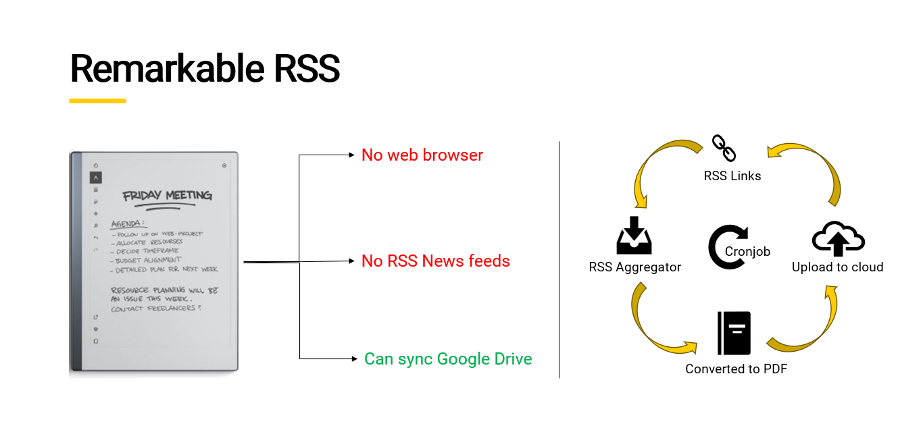

# Remarkable RSS

## Overview

`remarkable-rss.py` is a Python script designed to fetch and display RSS feeds in a format suitable for the Remarkable e-reader. It enables users to stay updated on various content by converting RSS feeds into a compatible document format and sending it strait into the google drive, so that users can read it on remarkable.

## Requirements

- Python 3.x
- Feedparser library
- Any additional libraries required for rendering or converting formats

### Thanks

Thanks to Remarkable for building such and amazing device.

[Link to Github](https://github.com/eksubin/Remarkable-RSS-Feed)
